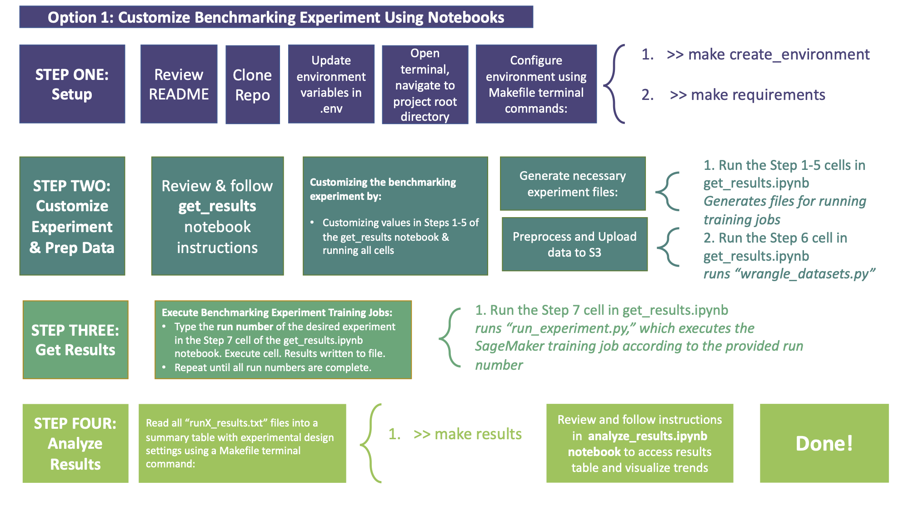
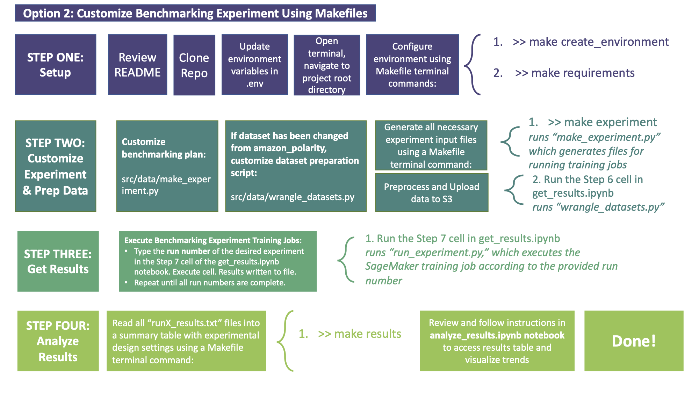

Benchmarking HuggingFace AutoModels 🤗 with Amazon SageMaker 
==============================

Table of Contents
------------
- [1. Overall Project Motivation](#1-overall-project-motivation)
- [2. distilBERT Benchmarking Project](#2-distilbert-benchmarking-project)
  * [2a. Project Scope](#2a-project-scope)
  * [2b. distilBERT Benchmarking Results](#2b-distilbert-benchmarking-results)
  * [2c. How to Explore the distilBERT Benchmarking Results](#2c-how-to-explore-the-distilbert-benchmarking-results)
- [3. How to Customize and Re-Use this Repo:](#3-how-to-customize-and-re-use-this-repo-)
  * [3a. Environment Setup, Local](#3a-environment-setup--local)
  * [3b. Environment Setup, SageMaker Notebooks](#3b-environment-setup--sagemaker-notebooks)
- [4. Getting Started](#4-getting-started)
  * [4a. Getting Started Option 1: Notebooks (reccomended to start)](#4a-getting-started-option-1--notebooks--reccomended-to-start-)
  * [4b. Getting Started Option 2 : Makefile Commands (reccomended for iterating fast)](#4b-getting-started-option-2---makefile-commands--reccomended-for-iterating-fast-)
- [5. Project Organization](#5-project-organization)
- [6. Known Issues/Bugs](#6-known-issues-bugs)
  * [EBS Volume Size (ArchiveError)](#ebs-volume-size--archiveerror-)
- [7. Security](#7-security)
- [8. License](#8-license)

## 1. Overall Project Motivation
In 2021, a series of machine learning features were released on AWS to help customers fine-tune and deploy pretrained natural language models quickly with HuggingFace. Hugging Face Deep Learning Containers (DLCs), the HuggingFace framework in the SageMaker Python SDK, and built-in compatibility with SageMaker data parallelism together reduce undifferentiated heavy lifting for customers interested in fine-tuning pretrained HuggingFace models to meet their business objectives. 

Some important factors for customers to plan for at the outset of a HuggingFace project are the downstream impacts of model size. HuggingFace pretrained models range from having multi-millions to billions of model parameters to fine-tune on customer datasets. Selecting a right-sized compute instance for the job of fine-tuning a pretrained model can reduce training times on such large models from days to minutes with AWS SageMaker.

However, anyone who is new to working with HuggingFace and AWS Sagemaker shares the same common questions:
*	How will increasing compute resources reduce my model training time?
*	How will the cost of running training jobs change?
*	How will model performance change, if at all?
*	How does the size of my dataset impact scaling compute resources? 

We have performed a benchmarking study to help customers and data scientists dive deeper into these trade-offs between training time, model performance, and cost when fine-tuning HuggingFace models on AWS SageMaker with distributed training. The results from this study will help customers and data scientists build intuition around points of diminishing returns when selecting compute resources to allocate for their machine learning projects with HuggingFace and AWS SageMaker. 

<b>A technical report summarizing the results of the distilBERT benchmarking can be found in </b>`reports`. All figures and experiments were executed using this repository.

## 2. distilBERT Benchmarking Project

### 2a. Project Scope
The distilBERT Benchmarking project using HuggingFace and Amazon SageMaker was executed over the summer of 2021, as the subject of [@hellosamstuart's](https://github.com/hellosamstuart) summer intern project with AWS Professional Services.

The scope of the distilBERT benchmarking performed in this repo is shown below. Compute was scaled, while measuring time, cost, and performance changes. Note the learning rate and the per device train batch size (i.e. per GPU batch size) were fixed. Therefore, the global batch sizes increased as instance compute power increased. An alternative design where global batch size is fixed could be implemented by customizing the benchmarking experiment table parameters (elaborated on in How to Customize this Repo). 

<b>Experiment Runs in Detail:</b>

<b>Overview of Parameters Used:</b>
* HuggingFace Pretrained AutoModel: distilbert-base-uncased
* Dataset/Task: binary text classification, of sentiment polarity of Amazon product reviews
   * "amazon-polarity" dataset from HuggingFace Datasets Hub
* Dataset size: 
   * 100,000 samples 
   * 600,000 samples 
   * 1,000,000 samples
* Instance Types:
   * ml.p3.2xlarge (1 GPU)
   * ml.p3.8xlarge (4 GPU)
   * ml.p3.16xlarge (8 GPU - 1 Node using SageMaker Data Parallel)
   * ml.p3.16xlarge (16 GPU - 2 Nodes using SageMaker Data Parallel)
   * ml.p3.16xlarge (32 GPU - 4 Nodes using SageMaker Data Parallel)

* Experimental controls:
   * Per Device Batch Size: 32
   * Learning Rate: 5e-5 (unless otherwise specified)
   * Number of Steps (for a given global batch size, to allow comparing training jobs with different numbers of samples)

<b>Dataset Credit:</b>

The dataset used in this experiment is the "Amazon Polarity" dataset from the HuggingFace Hub, used 
for binary text classification. The task predicts a positive or negative rating given text from an Amazon review.

See more about the Amazon Polarity dataset here: https://huggingface.co/datasets/amazon_polarity 

### 2b. distilBERT Benchmarking Results
The results shown below are from the default experimental design in this repository for a pretrained distilbert-base-uncased AutoModel from the HuggingFace transformers library.

### 2c. How to Explore the distilBERT Benchmarking Results
To explore the results further yourself:
1. Navigate to notebooks/analyze_results.ipynb
2. Explore data in the results table, and customize visualizations as desired

Please review the deep learning parameters used in the default benchmark when interpreting results. The global batch size used will impact benchmarking results.

## 3. How to Customize and Re-Use this Repo: 
This repo is meant to be re-used for custom benchmarking HuggingFace AutoModels with Amazon SageMaker instances and SageMaker data parallelism, in HuggingFace Deep Learning Containers. 

### 3a. Environment Setup, Local 
* `git clone` repo to desired local directory using the GitHub Clone URL
* Open repository root directory in desired IDE (tested with VSCode)
* Customize your environment variables in .env with your AWS information 
* Set up your development environment using Makefile commands from the terminal in the root directory of this repo:
   * `>> make environment`
   *  activate your virtual environment `>>source activate amazon-sagemaker-huggingface-benchmark`
   * If you are using VSCode, you may have to restart the IDE before you can select the newly created environment kernel to run your Jupyter Notebooks (shown below)
   

### 3b. Environment Setup, SageMaker Notebooks 
* `git clone` this repo to your SageMaker Notebook (can do on start-up, or in from the terminal in SageMaker Notebooks)
* With SageMaker Notebooks & HuggingFace Deep Learning Containers, the existing conda PyTorch kernels meet the basic installation requirements already. `conda_pytorch_latest_p36` kernel reccomended.
* To install any extra required packages, simply uncomment and run the provided cells at the start of each Jupyter Notebook containing `!pip install PACKAGE_NAME`
* Customize your environment variables in .env with your AWS information 
   * Note: if running in SageMaker Notebooks, you may have to update your SageMaker execution role manually in all .py scripts using the commented Python code provided in the .env file. 

## 4. Getting Started with a Custom Benchmark

The benchmarking experimental design can be changed by customizing repository files, using the process described by Option 1 (Notebooks) or Option 2 (Makefile) below. The design is changed via Option 1 or 2 by means of updating the file `data/interim/experimental_design.csv` programmatically.

Other HuggingFace AutoModels may be loaded for benchmarking by changing the environment variable `HF_MODEL`. An alternative dataset from the HuggingFace Hub may also be automatically loaded to this repo by changing the environment variable `HF_DATASET`. However, if changing the dataset, you will have to also adjust `wrangle_datasets.py` which is used to load data, preprocess/tokenize it, and upload it to S3. Additionally, if you are changing the modelling task, be sure to update the SageMaker training script in `src/models/train_model.py`. All imports of src in Jupyter Notebooks are done in this repository using relative module imports so things work out of the box, rather than requiring package installs with `pip install -e`, however you may change this if desired.

When getting started with customization, exploring the process using the provided Jupyter Notebooks (Option 1) is reccomended. After you are comfortable with the format for your benchmarking experiment, faster iteration can be done using the Makefile commands described in Option 2.

### 4a. Getting Started Option 1: Notebooks (reccomended to start)

### 4b. Getting Started Option 2 : Makefile Commands (reccomended for iterating fast)

## 5. Project Organization
    ├── LICENSE
    ├── Makefile           <- Makefile with commands to expedite iteration, like `make experiment` or `make results`
    ├── README.md          <- The top-level README for developers using this project.
    ├── data
    │   ├── interim        <- The final benchmarking experiment table, individual run files derived from it  
    │   │                     to instruct individual training jobs, and results files generated by training jobs
    │   ├── processed      <- The final results table, for visualization and analysis (joined from interim data)
    │   └── raw            <- The bare bones benchmarking experiment, containing number of nodes and dataset sizes to benchmark
    │
    │
    ├── notebooks              <- Jupyter notebooks for designing & running experiments (get_results), or reading results (analyze_results). 
    │   └── run_experiment.py  <- Allows get_results notebook to initiate training jobs based on your experimental design
    │                                               
    │
    ├── references         <- Data dictionaries, manuals, and all other explanatory materials.
    │
    ├── reports            <- Can contain in future any generated analysis as HTML, PDF, LaTeX, etc.
    │   └── figures        <- Generated graphics and figures to be used in reporting or README
    │
    ├── requirements.txt   <- The requirements file for reproducing the analysis environment, e.g.
    │                         generated with `pip freeze > requirements.txt`
    │
    ├── setup.py           <- makes project pip installable (pip install -e .) so src can be imported
    └── src                <- Source code for use in this project.
        ├── __init__.py    <- Makes src a Python module
        │
        ├── data           <- Scripts to manipulate data (make experimental design, downloadfrom HuggingFace 
        │   │                   and upload to s3, generate results from train jobs)
        │   └── make_experiment.py
        │   └── make_results.py
        │   └── wrangle_dataset.py 
        │
        ├── models         <- Custom SageMaker training script              
        │   └── train_model.py
        │
        └── visualization  <- Scripts for visualization in analyze_results.ipynb 
            └── visualize.py

## 6. Known Issues/Bugs

### EBS Volume Size (ArchiveError)
During the design of this repo and initial data collection, some data was collected by cloning failed training jobs launched via the SDK as described in get_results Step 7, and adjusting their EBS volumes manually. This was neccessary to work around a bug that prevented custom EBS volume_size values from being passed into SageMaker. The runs executed in the console can be identified by the title of their associated training job (different than standard format in run_experiment.py). 

If you are designing a custom benchmarking experiment, and notice your training jobs do not have the correct volume_size passed to them, (consequently causing an ArchiveError and job failure), you can work around the issue by cloning the failed training job in the Console and adjusting the EBS volume manually. The results of any training job you have executed in your account can be looked up manually by passing the name of the training job and run number while executing the last cell in the get_results notebook, titled "Manual Results Lookup."

## 7. Security

See [CONTRIBUTING](CONTRIBUTING.md#security-issue-notifications) for more information.

## 8. License

This library is licensed under the MIT-0 License. See the LICENSE file.

--------

<small>Project based on the <a target="_blank" href="https://drivendata.github.io/cookiecutter-data-science/">cookiecutter data science project template</a>. #cookiecutterdatascience</small>

