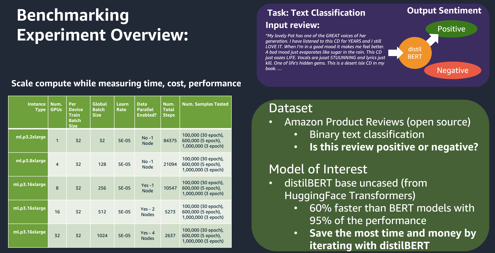
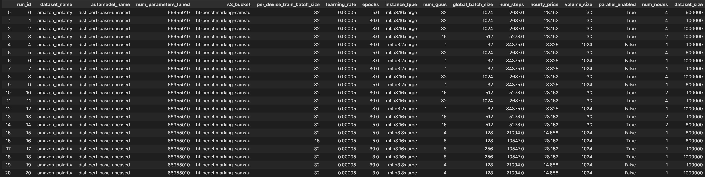
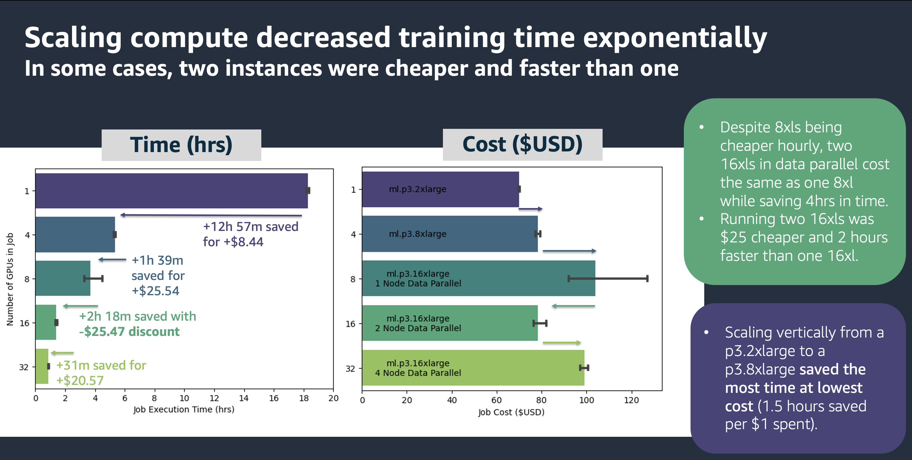
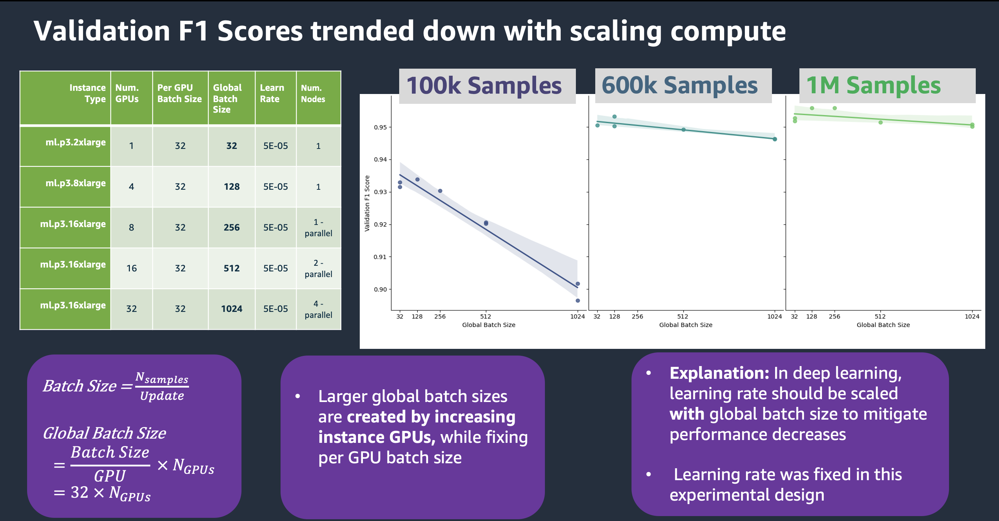
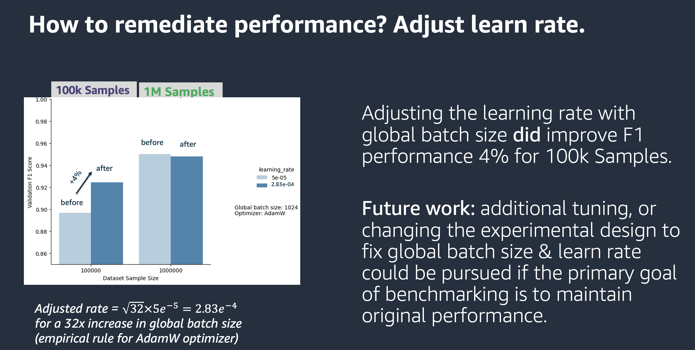

amazon-sagemaker-huggingface-benchmark 🤗
==============================

Project Motivation
------------
In 2021, a series of machine learning features were released on AWS to help customers fine-tune and deploy pretrained natural language models quickly with HuggingFace. Hugging Face Deep Learning Containers (DLCs), the HuggingFace framework in the SageMaker Python SDK, and built-in compatibility with SageMaker data parallelism together reduce undifferentiated heavy lifting for customers interested in fine-tuning pretrained HuggingFace models to meet their business objectives. 

Some important factors for customers to plan for at the outset of a HuggingFace project are the downstream impacts of model size. HuggingFace pretrained models range from having multi-millions to billions of model parameters to fine-tune on customer datasets. Selecting a right-sized compute instance for the job of fine-tuning a pretrained model can reduce training times on such large models from days to minutes with AWS SageMaker.

However, anyone who is new to working with HuggingFace and AWS Sagemaker shares the same common questions:
*	How much will SageMaker distributed data parallelism reduce my model training time?
*	How will the cost of running training jobs change?
*	How will model performance change, if at all, by using distributed data parallelism to reduce training time?
*	How do all of these factors change again for different amounts of sample data used in the fine-tuning process?

We have performed a benchmarking study to help customers and data scientists dive deeper into these trade-offs between training time, model performance, and cost when fine-tuning HuggingFace models on AWS SageMaker with distributed training. The results from this study will help customers and data scientists build intuition around points of diminishing returns when selecting compute resources to allocate for their machine learning projects with HuggingFace and AWS SageMaker. 

Project Scope
------------
The scope of the experiment performed in this repo is as follows.

<b>Experiment Plan:</b>

<b>Experiment Runs in Detail:</b>

<b>Overview of Parameters Used:</b>
* HuggingFace Pretrained AutoModel: distilbert-base-uncased
* Dataset/Task: binary text classification, of sentiment polarity of Amazon product reviews
   * "amazon-polarity" dataset from HuggingFace Datasets Hub
* Dataset size: 
   * 100,000 samples 
   * 600,000 samples 
   * 1,000,000 samples
* Instance Types:
   * ml.p3.2xlarge (1 GPU)
   * ml.p3.8xlarge (4 GPU)
   * ml.p3.16xlarge (8 GPU - 1 Node using SageMaker Data Parallel)
   * ml.p3.16xlarge (16 GPU - 2 Nodes using SageMaker Data Parallel)
   * ml.p3.16xlarge (32 GPU - 4 Nodes using SageMaker Data Parallel)

* Experimental controls:
   * Per Device Batch Size: 32
   * Learning Rate: 5e-5 (unless otherwise specified)
   * Number of Steps (for a given global batch size, to allow comparing training jobs with different numbers of samples)

The above tables illustrate the default design. As the user of this repo, you are more than welcome to adjust the parameters based on your needs, as described in the workflow diagram below. 

How to Use This Repo
------------
<b>Set up environment:</b>
* `git clone` repo to desired directory using the Clone URL
* Open repository in desired IDE (tested with VSCode, SageMaker Notebooks)
   * Note: in SageMaker Notebooks, existing Conda PyTorch kernels meets majority of installation requirements already
   * To install any extra required packages, simply uncomment and run the provided cells at the start of each Jupyter notebooks containing `!pip install PACKAGE_NAME`
* If working in a local IDE such as VSCode, set up environment using makefile commands in Terminal:
   * `>>make environment`
   *  activate your virtual environment `>>source activate amazon-sagemaker-huggingface-benchmark`
   * If you are using VSCode, you may have to restart the IDE before you can select the newly created environment kernel for your Jupyter Notebook (shown below)
   

<b>1. To explore the results of the existing benchmark of distilBERT on SageMaker:</b>
* Navigate to notebooks/analyze_results.ipynb
* Explore data in the results table, and customize visualizations as desired

<b>2. To change the experimental design and run new jobs follow the below workflow:</b>
* Note: you will have to add your custom AWS configuration information in the .env file (role, s3 bucket)

Project Organization
------------

    ├── LICENSE
    ├── Makefile           <- Makefile with commands to expedite iteration, like `make experiment` or `make results`
    ├── README.md          <- The top-level README for developers using this project.
    ├── data
    │   ├── external       <- Extra external information about the default experimental design.
    │   ├── interim        <- Individual experiment run files and results generated by training jobs
    │   ├── processed      <- The final, canonical results dataset for visualization and analysis.
    │   └── raw            <- The original, immutable data dump.
    │
    │
    ├── notebooks              <- Jupyter notebooks for running the experiments (getting results), and analyzing results (analyze_results). 
    │   └── run_experiment.py  <- Allows get_results notebook to run training jobs directly based on your experimental design
    │                                               
    │
    ├── references         <- Data dictionaries, manuals, and all other explanatory materials.
    │
    ├── reports            <- Can contain in future any generated analysis as HTML, PDF, LaTeX, etc.
    │   └── figures        <- Generated graphics and figures to be used in reporting or README
    │
    ├── requirements.txt   <- The requirements file for reproducing the analysis environment, e.g.
    │                         generated with `pip freeze > requirements.txt`
    │
    ├── setup.py           <- makes project pip installable (pip install -e .) so src can be imported
    └── src                <- Source code for use in this project.
        ├── __init__.py    <- Makes src a Python module
        │
        ├── data           <- Scripts to manipulate data (make experimental design, downloadfrom HuggingFace 
        │   │                   and upload to s3, generate results from train jobs)
        │   └── make_experiment.py
        │   └── make_results.py
        │   └── make_s3_upload.py
        │   └── wrangle_dataset.py 
        │
        ├── models         <- Scripts to train models via SageMaker training jobs.              
        │   └── train_model.py
        │
        └── visualization  <- Scripts for visualization in analyze_results.ipynb 
            └── visualize.py

Dataset Credit
------------
The dataset used in this experiment is the "Amazon Polarity" dataset from the HuggingFace Hub, used 
for binary text classification. The task predicts a positive or negative rating given text from an Amazon review.

See more about it here: https://huggingface.co/datasets/amazon_polarity 

Benchmarking Results
------------
The results shown below are from the default experimental design in this repository for a pretrained distilbert-base-uncased AutoModel from the HuggingFace transformers library.

Known Issues/Bugs
------------
During the design of this repo and initial data collection, some data was collected by cloning failed training jobs launched via the SDK as described in get_results Step 7, and adjusting their EBS volumes manually. This was neccessary to work around a bug that prevented custom EBS volume_size values from being passed into SageMaker. The runs executed in the console can be identified by the title of their associated training job (different than standard format in run_experiment.py). However running the jobs in the console vs the SDK does not impact the ultimate results of the training job. If you are designing a custom experiment, and notice your training jobs do not have the correct volume_size passed to them, consequently causing an ArchiveError and job failure, you can work around the issue by cloning the failed job and adjusting the EBS volume manually. The results of any training job you have executed in your account can be looked up manually by passing the name of the training job and run number while executing the last cell in the get_results notebook titled "Manual Results Lookup."

## Security

See [CONTRIBUTING](CONTRIBUTING.md#security-issue-notifications) for more information.

## License

This library is licensed under the MIT-0 License. See the LICENSE file.

--------

<small>Project based on the <a target="_blank" href="https://drivendata.github.io/cookiecutter-data-science/">cookiecutter data science project template</a>. #cookiecutterdatascience</small>

